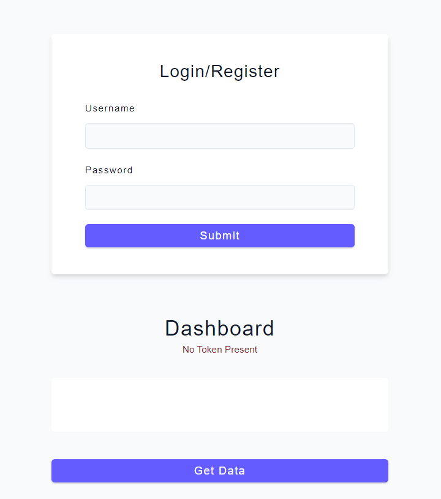
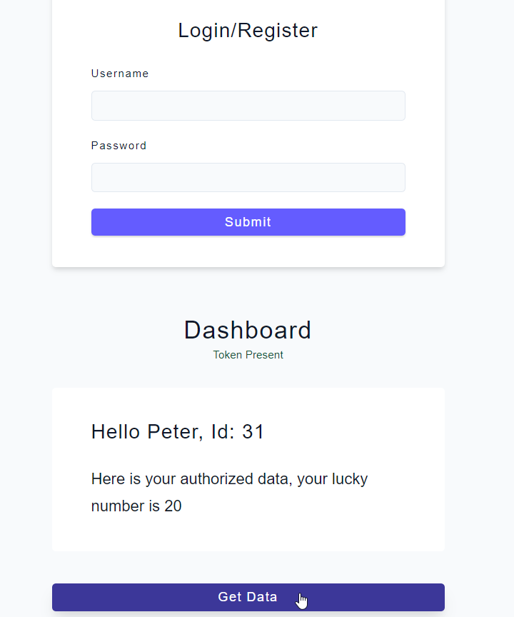

# JWT Basics 

## Abstract  / Resumen:
 In this proyect I learned about the fundamentals about JWT, and implemented them in this simple app. It has a Login that providing a username and a password send the request to the server, ir returns a JWT, and let you access some information when clicking the "Get Data" button.

 /
 En este proyecto aprendí los conceptos fundamentales sonbre Jason Web Tokens y los implementé en esta aplicación sencilla. Consiste de un Login en el que al ingresar un username y una password envía una request al servidor que devuelve su JWT con el que podemos accesar a cierta información cuando clickeamos el botón "Get Data".

### First steps / Primeros pasos:
In order to run this app, you must create a .env file in the root directory with the following text:
> JWT_SECRET = "TheSecretYouChooseForSecurityPurposes"

/
Para poder correr esta app, primero debes crear un archivo .env en el directorio raiz con el siguiente texto:
> JWT_SECRET = "AquíIntroduceUnaPalabraDeTuElección"

### Some Snaps: 

- Initial Page:

- After requesting data:

- You can check out more snaps in the [Readme-img](./Readme-img) folder.

